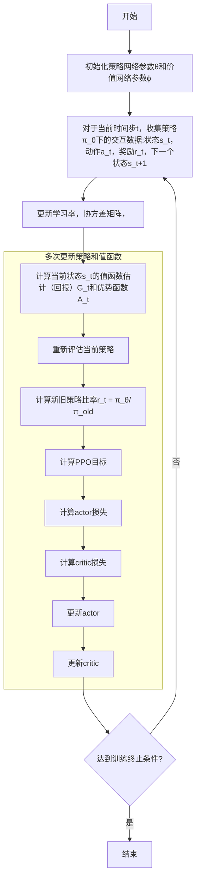

# 开始

首先我们需要了解RL的概念，RL主要是Agent在环境中不断的交互，通过试错的方式学习到最优的**策略**，从而实现最大化奖励的目标。
在交互的每一步，Agent会感知来自环境的奖励信号，这个数字告诉它当前环境状态的好坏，Agent会根据这个信号来更新自己的策略。

需要清楚的是，强化学习的数学基础就算马尔可夫决策MDP，一个MDP 通常由状态空间、动作空间、状态转移矩阵、奖励函数以及折扣因子等组成。

首先，我们定义一下相关的术语：

- 状态S：是对世界状态的完整描述，没有任何关于世界的信息隐藏在状态中。
- 观察o：是对状态的部分描述，可能会省略一些信息。

> 这里可以理解为一个小球是s，而o就是我们用光将其投影在墙面上得到的影子。因此o是不全面的认知，而s是全面的认知。

在RL中，我们通常使用向量，矩阵或高阶张量来表示状态和观察。例如，视觉观察可以有像素值RGB矩阵表示，而机器人的状态可能由关节角度和速度向量表示。

- 动作空间A：不同环境允许不同的动作$a_t$，给定环境中所有有效动作的集合为动作空间
> 一般我们将大写A表示未来的动作空间，小写a表示当前或过往已经发生时刻的动作。

- 策略：策略是Agent在给定状态下选择动作的规则。策略可以表示为函数，该函数接受状态作为输入并输出动作。策略可以是有确定性的，也可以是随机的。确定性策略总是选择相同的动作，而随机策略可能会选择不同的动作，即使给定相同的输入状态。
    
    一般情况下，策略函数是一个条件概率密度函数 $\pi (a|s) = P(A=a|S=s)$

    - 确定情况下，通常用 $\mu$ : $a_t = \mu(s_t)$ 
    - 随机情况下，通常用 $\pi$ : $a_t \sim \pi(·|s_t)$

    这里举个例子，在*超级玛丽*这个游戏中，他只能上左右三个动作，假设策略函数输出动作的概率为：
        $$\pi (左|s)=0.2$$
        $$\pi (右|s)=0.1$$
        $$\pi (上|s)=0.7$$
    那么Agent就会做一个随机抽样：有0.2的概率向左走，有0.1的概率向右走，有0.7的概率向上跳。
    
在深度 RL 中，我们处理参数化策略：其输出是可计算函数的策略，这些函数依赖于一组参数（例如神经网络的权重和偏差），我们可以通过一些优化算法来调整这些参数以改变行为。
通常用 或 \phi 来 \theta 表示此类策略的参数，然后将其作为下标写入策略符号上以突出显示连接：
    $$a_t = \mu_\phi (s_t)$$ 
    $$a_t \sim_\phi \pi(·|s_t)$$

- 奖励r：奖励是环境对Agent采取动作的反馈，通常是一个标量值。奖励函数通常表示为 $R(s_t, a_t)$，其中 $s_t$ 是在时间步 $t$ 时Agent的状态，$a_t$ 是Agent在时间步 $t$ 时采取的动作。奖励函数可以是有确定性的，也可以是随机的。确定性奖励函数总是输出相同的奖励，而随机奖励函数可能会输出不同的奖励，即使给定相同的输入状态和动作。**而奖励函数通常是由我们来定义。**

- 状态转移：是指当前状态s变成新的状态s’。给定当前的状态s，Agent执行动作a后，环境给出下一时刻状态s’。而这个新的状态s’是环境通过状态转移函数计算出来的，它能够将(s,a)映射到s’。
- 状态转移函数：是可以确定的，也可以是随机的。**确定性状态转移函数**比如下棋，当前状态s，和玩家执行动作a，就可以确定新的状态s’，而**随机状态转移函数**比如超级玛丽中，玛丽如果向上跳，其位置就上去了，这个是确定的，但是其敌人的位置可以往左也可能往由，因此难以确定下一状态。
    - 随机状态转移函数通常记作$p(s'|s,a)=P(S'=s'|S=s,A=a)$，也是一个条件概率密度函数。意思是如果观测到当前状态 s 以及动作a，那么p函数就能输出状态变成s'的概率。

- 价值函数
    - 状态价值函数：$v_\pi(s)$ 表示在给定策略 $\pi$ 下，从状态s开始，Agent期望在未来获得的奖励总和。状态价值函数可以表示为：
        $$V_\pi(s) = E_\pi[R_t + \gamma R_{t+1} + \gamma^2 R_{t+2} + \cdots | S_t = s]$$
        > 回报 $G_t = R_t + \gamma R_{t+1} + \gamma^2 R_{t+2} + \cdots $ , 这里的 $\gamma$ 是一个折扣因子，用来权衡即时奖励和未来奖励的重要性。$\gamma$ 的取值范围是0到1，$\gamma$ 越接近1，Agent越重视未来奖励，$\gamma$ 越接近0，Agent越重视即时奖励。
        
    - 动作价值函数：$q_\pi(s,a)$ 表示在给定策略 $\pi$ 下，从状态s开始，执行动作a后，Agent期望在未来获得的奖励总和。动作价值函数可以表示为：
        $$Q_\pi(s,a) = E_\pi[R_t + \gamma R_{t+1} + \gamma^2 R_{t+2} + \cdots | S_t = s, A_t = a]$$
    - 价值函数通常用来评估状态的好坏，而策略函数用来选择动作。价值函数和策略函数是相互关联的，它们共同决定了Agent的行为。

- 优势函数 A_t：优势函数是用来衡量在给定状态下，执行某个动作相对于平均动作的预期回报。优势函数可以表示为：$A(s, a) = Q(s, a) - V(s)$
    - A(s, a) 是优势函数，表示在状态 s 下采取动作 a 的优势。
    - Q(s, a) 是状态-动作价值函数，表示在状态 s 下采取动作 a 后的预期回报。
    - V(s) 是状态价值函数，表示在状态 s 下采取任意动作的预期回报。

    优势函数的取值范围为 [-1, 1]。当 A(s, a) > 0 时，表示在状态 s 下采取动作 a 比平均情况更好；当 A(s, a) < 0 时，表示在状态 s 下采取动作 a 比平均情况更差；当 A(s, a) = 0 时，表示在状态 s 下采取动作 a 与平均情况相当。

- 奖励到目标的值（rewards-to-go）：表示从当前时间步开始到未来的累积奖励。在PPO算法中，奖励到目标的值用于计算优势函数和更新策略网络。帮助我们评估每个动作的好坏，并指导策略网络的更新。通过不断优化策略网络，我们可以使策略网络更好地选择高回报的动作。

## PPO

PPO算法是一种基于策略梯度的强化学习算法，它通过限制策略更新幅度来减少策略更新的方差，从而提高训练稳定性。PPO算法的主要思想是使用重要性采样来计算策略梯度，并通过截断技巧来限制策略更新的幅度。

PPO算法的主要步骤如下：

1. 初始化策略参数 $\theta$ 和价值函数参数 $\phi$。
2. 对于每个时间步 $t$，Agent根据当前策略 $\pi_\theta$ 选择动作 $a_t$，并观察环境反馈的奖励 $r_t$ 和下一个状态 $s_{t+1}$。
3. 计算当前状态 $s_t$ 的价值函数 $v_\phi(s_t)$。
4. 使用重要性采样计算策略梯度，并计算截断技巧的参数 $\epsilon$。
5. 更新策略参数 $\theta$，使得新的策略 $\pi_\theta$ 在当前状态 $s_t$ 下选择动作 $a_t$ 的概率尽可能接近原始策略 $\pi_\theta$ 在当前状态 $s_t$ 下选择动作 $a_t$ 的概率。
6. 更新价值函数参数 $\phi$，使得新的价值函数 $v_\phi(s_t)$ 尽可能接近实际回报 $G_t$。
7. 重复步骤2-6，直到达到预定的训练步数或达到预定的性能指标。

PPO算法的主要优点是它能够有效地减少策略更新的方差，从而提高训练稳定性。PPO算法的主要缺点是它需要大量的计算资源，因为它需要计算策略梯度和价值函数的梯度。

