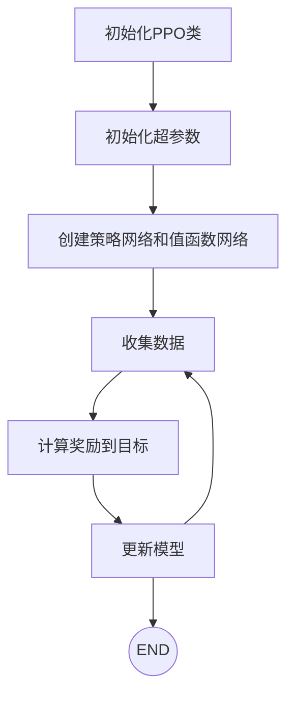
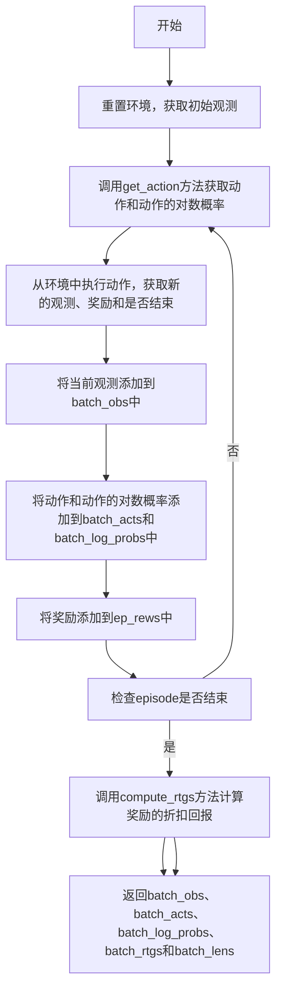

# PPO Learning

> The PPO algorithm is a policy optimisation algorithm used to train policies in reinforcement learning.The PPO algorithm updates the policy by minimising the KL dispersion of the policy, thus avoiding drastic changes in the policy.The PPO algorithm updates the policy by maximising the objective function, which consists of the payoffs of the current policy and an estimate of its dominance.The PPO algorithm avoids drastic changes in the policy by truncating the objective function, thusimprove the stability of the algorithm.


> This project will use the PPO algorithm to train a policy to be able to reach a target state in a given environment.

This is my python environment:

```python
Python 3.9.20
conda create -n ppo python=3.9
conda activate ppo
pip install -r requirements.txt
```


```python 

1. Input: 策略参数，初始值函数参数  
2. for k=0,1,2,.. do:
3.     在env中通过运行策略函数Π_k采集轨迹D_k
4.     计算每次奖励R_t
5.     根据当前的价值函数V_k，计算优势估计值A_t
6.     通过最大化 PPO-Clip 目标来更新政策：通常是通过Adam的随机梯度上升算法。
7.     通过均方误差回归拟合值函数:通常是通过某种梯度下降算法。
8. end for

```

# 整体流程





## 代码实现

1. PPO类 - rollout方法




📕 参考链接：https://medium.com/@eyyu/coding-ppo-from-scratch-with-pytorch-part-2-4-f9d8b8aa938a